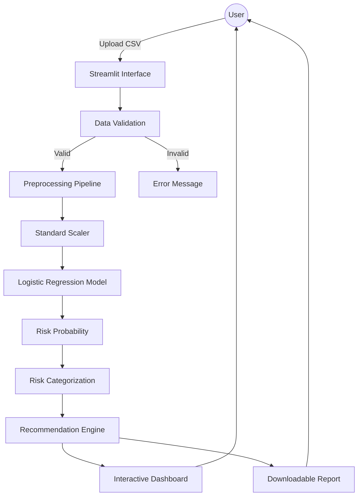
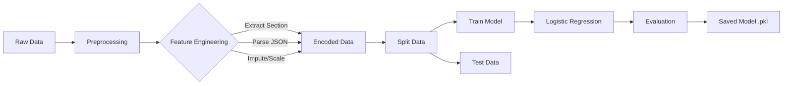

# Student Risk Analysis System

## Problem Understanding

Educational institutions often struggle to identify students who are at risk of poor placement performance early enough to intervene effectively. This system aims to solve this problem by analyzing historical academic data and engagement metrics to predict placement risk. By categorizing students into 'At-risk', 'Average', and 'High-performing' groups, the system enables targeted interventions and provides personalized study recommendations to improve student outcomes.

## System Architecture

## ML Pipeline

## Workflow Image

## Input-Output Specification

### Input

A CSV file containing student academic records.
**Required Columns:**

- `URN`: Unique Reference Number (used to extract Section).
- `Maths`, `SESD`, `AIML`, `FSD`, `DVA`: Subject scores (Float/Int).
- `topic_wise_accuracy`: JSON string representing accuracy per topic (Optional).
- `time_spent_per_topic`: JSON string representing time spent per topic (Optional).

### Output

1.  **Risk Category**:
    - **At-risk**: Probability < 0.40
    - **Average**: 0.40 <= Probability < 0.80
    - **High-performing**: Probability >= 0.80
2.  **Risk Score**: A probability score indicating the likelihood of successful placement.
3.  **Recommendations**: Actionable study advice based on the risk category.

## Model Limitations

1.  **Synthetic Target**: The model is trained on a synthetic target variable derived from the average of subject scores (>75% considered "Placed"). This means the model predicts "High Academic Performance" rather than actual placement success.
2.  **Linearity Assumption**: The Logistic Regression model assumes a linear relationship between features and the log-odds of the outcome, which may not capture complex non-linear patterns.
3.  **Data Imputation**: Missing values are imputed with the mean, which can reduce the variance of the dataset and potentially bias the model.
4.  **Limited Context**: The current model relies heavily on academic scores and does not account for external factors like soft skills, project work, or extracurricular activities.
