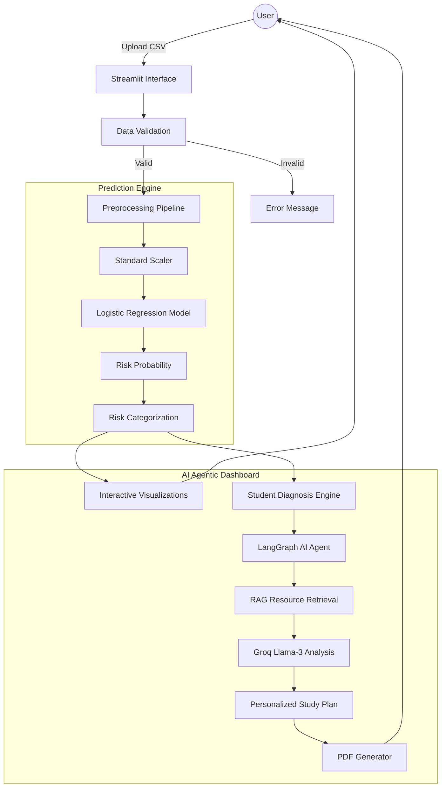
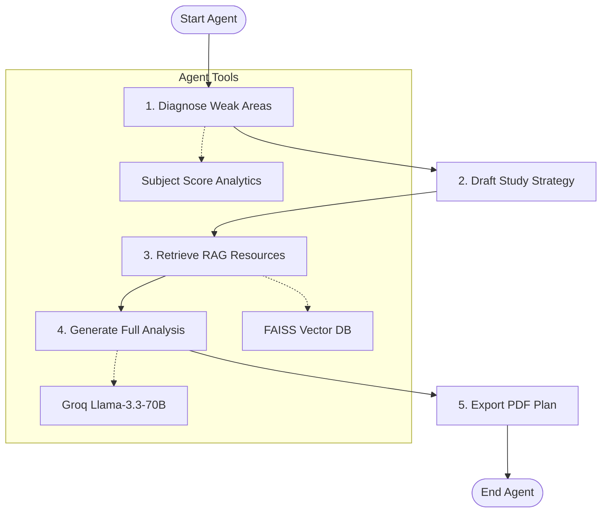
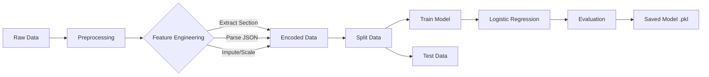
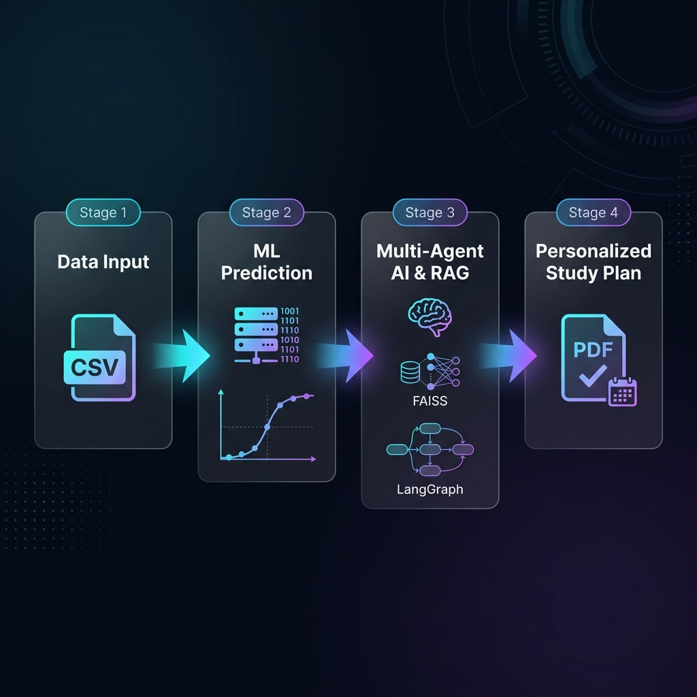

# Multi-Agent Student Diagnostic & Study Planning System

## Problem Understanding

Educational institutions often struggle to identify students at risk of poor academic or placement performance early enough to intervene effectively. This system provides an end-to-end AI-driven solution that not only predicts student risk using machine learning but also generates personalized, deep-diagnostic study plans using a multi-agent workflow. By categorizing students into 'At-risk', 'Average', and 'High-performing', and providing RAG-driven resources, the system enables meaningful, data-driven interventions to improve student outcomes.

## System Architecture

The following diagram illustrates the complete system architecture, integrating the ML prediction pipeline with the AI-driven agentic diagnostics.

```mermaid
graph TD
    User((User)) -->|Upload CSV| UI[Streamlit Interface]
    UI --> Validator[Data Validation]
    Validator -->|Valid| Preprocessor[Preprocessing Pipeline]
    Validator -->|Invalid| Error[Error Message]
    
    subgraph "Prediction Engine"
    Preprocessor --> Scaler[Standard Scaler]
    Scaler --> Model[Logistic Regression Model]
    Model --> Prob[Risk Probability]
    Prob --> Logic[Risk Categorization]
    end
    
    subgraph "AI Agentic Dashboard"
    Logic --> Dash[Interactive Visualizations]
    Logic --> Diagnostician[Student Diagnosis Engine]
    Diagnostician --> Agent[LangGraph AI Agent]
    Agent --> RAG[RAG Resource Retrieval]
    RAG --> LLM[Groq Llama-3 Analysis]
    LLM --> Report[Personalized Study Plan]
    Report --> PDF[PDF Generator]
    end
    
    Dash --> User
    PDF --> User
```

## AI Agentic Workflow

The system uses **LangGraph** to manage a multi-step agentic process for students who require additional support (At-risk and Average categories).

```mermaid
graph TD
    Start([Start Agent]) --> Diagnose[1. Diagnose Weak Areas]
    Diagnose --> Plan[2. Draft Study Strategy]
    Plan --> Retrieve[3. Retrieve RAG Resources]
    Retrieve --> Report[4. Generate Full Analysis]
    Report --> PDF[5. Export PDF Plan]
    PDF --> End([End Agent])
    
    subgraph "Agent Tools"
    Diagnose -.-> Tool1[Subject Score Analytics]
    Retrieve -.-> Tool2[FAISS Vector DB]
    Report -.-> Tool3[Groq Llama-3.3-70B]
    end
```

## Key Features

1.  **AI Study Planner (Powered by Groq)**: Integrated deep analysis using Llama-3.3-70B models to generate high-quality academic counseling.
2.  **Agentic Workflow (LangGraph)**: A persistent, multi-node state machine that manages the diagnosis, strategy, and resource retrieval process.
3.  **RAG System (Retrieval-Augmented Generation)**: Uses a FAISS vector database to retrieve the most relevant YouTube videos and documentation according to specific student weaknesses.
4.  **Data-Driven Diagnostics**: Identifies 'Critical Weak Areas' and 'Areas for Improvement' through a dedicated algorithmic engine.
5.  **Professional PDF Reports**: Automated generation of download-ready study plans including milestones, weekly goals, and curated resource links.
6.  **Interactive Dashboards**: Dynamic Plotly visualizations for risk distribution and student-wise performance drill-downs.

## ML Pipeline

```mermaid
graph LR
    A[Raw Data] --> B[Preprocessing]
    B --> C{Feature Engineering}
    C -->|Extract Section| D[Encoded Data]
    C -->|Parse JSON| D
    C -->|Impute/Scale| D
    D --> E[Split Data]
    E --> F[Train Model]
    E --> G[Test Data]
    F --> H[Logistic Regression]
    H --> I[Evaluation]
    I --> J[Saved Model .pkl]
```

## Workflow Image

## Input-Output Specification

### Input

A CSV file containing student academic records.
**Required Columns:**

-   `student_name`: Name of the student (Optional for reports).
-   `URN`: Unique Reference Number (used to extract Section).
-   `Maths`, `SESD`, `AIML`, `FSD`, `DVA`: Subject scores (Float/Int).
-   `topic_wise_accuracy`: JSON representing accuracy per topic.
-   `time_spent_per_topic`: JSON representing time spent per topic.

### Output

1.  **Risk Category**:
    -   **At-risk**: Probability < 0.40
    -   **Average**: 0.40 <= Probability < 0.80
    -   **High-performing**: Probability >= 0.80
2.  **AI Diagnosis**: Comprehensive report on strengths and specific gaps.
3.  **Curated Resources**: Direct links to study materials for weak areas discovered via RAG.
4.  **Study Plan PDF**: A printable, personalized 4-week learning roadmap.

## Tech Stack

-   **Frontend**: Streamlit
-   **AI Engine**: Groq (Llama-3.3-70B-Versatile)
-   **Agentic Framework**: LangGraph
-   **Vector Database**: FAISS (RAG System)
-   **ML Model**: Scikit-Learn (Logistic Regression)
-   **PDF Generation**: FPDF2
-   **Visualizations**: Plotly

## Model Limitations

1.  **Synthetic Target**: The model is trained on a synthetic target variable derived from average scores (>75% considered "Placed").
2.  **Linearity Assumption**: Logistic Regression assumes linear log-odds, which may miss complex non-linear patterns.
3.  **Data Context**: Currently relies on academic scores; does not account for interview skills or extracurricular projects.

